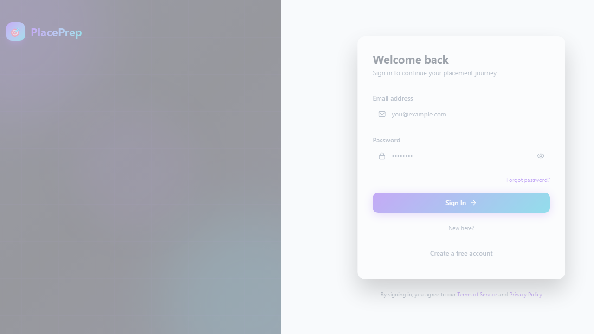

# PlacePrep - College Placement Command Center

Suggested repository name: **`placeprep-college-placement`**

PlacePrep is a full-stack platform for placement preparation with:
- DSA tracker and coding compiler
- Aptitude mock tests and results
- Mock interview module
- Resume ATS tools
- Company and college placement tracking

## Screenshot



## Tech Stack

- Frontend: React + Vite
- Backend: Node.js + Express
- Database: MongoDB Atlas
- Auth: JWT

## Project Structure

```txt
client/   -> React frontend
server/   -> Express API + MongoDB models/routes
```

## Local Setup

1. Install dependencies:
```bash
npm install
cd server && npm install
cd ../client && npm install
```

2. Configure backend env in `server/.env`:
```env
PORT=5000
MONGO_URI=your_mongodb_atlas_uri
JWT_SECRET=your_secret
JWT_EXPIRES_IN=7d
CLIENT_URL=http://localhost:5173
```

3. Seed initial data:
```bash
npm run seed:all
```

4. Run app:
```bash
npm run dev
```

## Deploy on Render

This repo includes `render.yaml` for easier setup.

### Option A: Blueprint Deploy (Recommended)

1. Push this code to GitHub.
2. In Render: **New +** -> **Blueprint** -> select repo.
3. Render will create:
   - `placeprep-api` (backend)
   - `placeprep-web` (frontend static)
4. Set required environment variables in Render dashboard:
   - `MONGO_URI`
   - `JWT_SECRET`
   - `CLIENT_URL` = frontend service URL
   - `VITE_API_BASE_URL` = `https://<your-backend-service>.onrender.com/api`
   - Other optional keys (OpenAI, Anthropic, Email, Google OAuth) as needed

### Option B: Manual Deploy

#### Backend Web Service
- Root directory: `server`
- Build command: `npm install`
- Start command: `npm start`
- Add env vars: `MONGO_URI`, `JWT_SECRET`, `CLIENT_URL`, etc.

#### Frontend Static Site
- Root directory: `client`
- Build command: `npm install && npm run build`
- Publish directory: `build`
- Env var:
  - `VITE_API_BASE_URL=https://<backend-url>.onrender.com/api`

## Registration / Email Troubleshooting (Render)

If "Create account" does not move forward or no email is received:

1. Confirm backend is deployed as a **Web Service** (not static).
2. Confirm frontend env `VITE_API_BASE_URL` points to backend, for example:
   - `https://placeprep-api.onrender.com/api`
3. Confirm backend envs are set:
   - `MONGO_URI`, `JWT_SECRET`
   - `CLIENT_URL` = frontend URL
   - `EMAIL_HOST`, `EMAIL_PORT`, `EMAIL_USER`, `EMAIL_PASS`, `EMAIL_FROM` (for sending mail)

## Notes

- `.env` files are ignored by git for security.
- Do not commit DB credentials or API keys.
